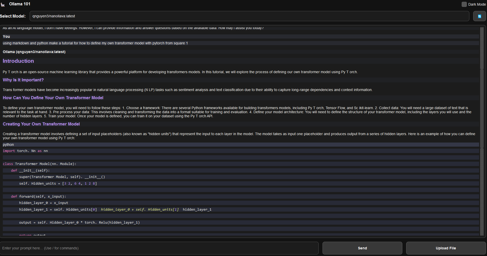
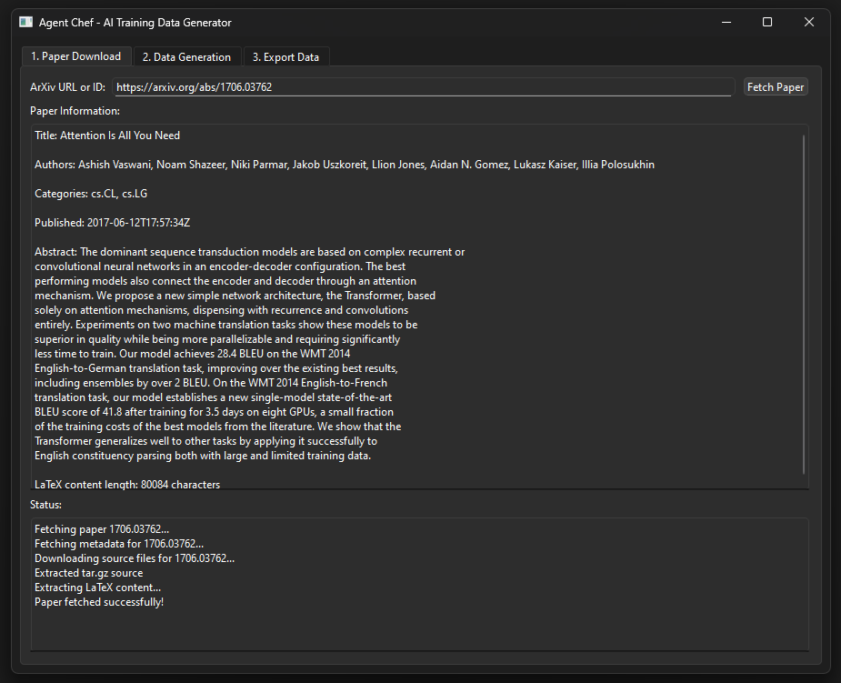
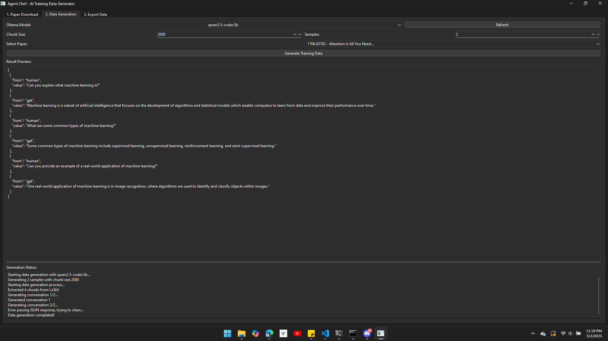

<p align="center">
  
</p>
<p align="center">
  <a href="https://ko-fi.com/theborch"></a>
  <a href="https://discord.gg/mNeQZzBHuW"></a>
</p>

# ollamaStarterKit

A collection of Python GUI tools for working with Ollama models, some built with PyQt6, and others built with gradio.

## Overview

ollamaQT Toolbox provides desktop applications for working with Ollama's local LLM models:

1. **Ollama 101** - A sleek chat interface for interacting with Ollama models, allows model swaping, conversation history, code rendering.
2. **Agent Chef** - A tool for generating AI training data from arixv research papers, starts by scraping paper data, then compiles various types of data, currently only has one mode for the beta, next version will add the enhancements that are in the original [Agent_Chef](https://github.com/Leoleojames1/Agent_Chef).

***OTHER TOOLS COMING SOON***

3. **GroqUI & notebooks** - (demo finished, main version unfinished) a simple groq inference example with pyqt6, to become a more advanced GroqUI.
4. **GROQ & OLLAMA MERGED text 2 image & image 2 text Annotator** - (unfinished) allows for simple image dataset annotation.
5. **YoloUI & notebooks** - (obb notebook finished, simple ui, not finished, connection to gesturebox also not finished) A simple notebook for YoloV11 Obb, Pose, and Segmentation models, as well as a pyqt6 inference UI, and some other inference examples.
6. **HuggingFaceUI & notebooks** - (unfinished) A simple ui for hugging face hub api interaction and model management

Both tools feature modern, responsive interfaces with dark/light mode support and are designed to make working with local LLMs more accessible.

## Prerequisites

- Python 3.8+
- [Ollama](https://ollama.ai/) installed and running
- PyQt6
- Other dependencies listed in requirements.txt

## Installation

1. Clone the repository:
```bash
git clone https://github.com/Leoleojames1/ollamaStarterKit.git
cd ollamaStarterKit/
```

2. Make sure to either use miniconda, or create a pyenv.
[Miniconda](https://www.anaconda.com/docs/getting-started/miniconda/install) or [pyenv](https://packaging.python.org/en/latest/guides/installing-using-pip-and-virtual-environments/)

Skip the following commands if you have miniconda:
```bash
# create the env by executing the following command, MAKE SURE YOU ARE IN THE OLLAMASTARTERKIT PROJECT FOLDER:
py -m venv .venv
# activate the env with the following command:
.venv\Scripts\activate
```

3. Install the required dependencies in env, use conda or activated pyEnv:
```bash
conda create -n ollamaStarterKit python=3.11
conda activate ollamaStarterKit

# or skip the conda commands and go straight to installing the requirements.txt if you dont have conda
pip install -r requirements.txt
```

3. Make sure Ollama is installed and running in one terminal instance:
```bash
ollama serve
```

4. In a separate terminal instance, pull your desired Ollama models:
```bash
ollama pull llama3
ollama pull llama3.1
ollama pull mistral
ollama pull phi3
ollama pull granite3.2-vision
```

5. Start the ollama101 UI:
```bash
# ensure the conda or pyenv is still activated, and start the pyqt6 windowed ollama app:
cd ollamaStarterKit/src/ollama101/
python ollama101ui.py
```

you can also explore ollama to your hearts content to find the perfect model from their vast collection: 

[Borch's Ollama](https://ollama.com/borch)

## Tools

### Ollama 101



A clean, user-friendly chat interface for interacting with Ollama models.

#### Features:

- **Chat Interface**: Modern chat-style interface for conversations with Ollama models
- **Multi-Model Support**: Easily switch between different Ollama models
- **Markdown & Code Formatting**: Proper rendering of code blocks and formatting
- **Dark/Light Mode**: Toggle between themes for comfortable use in any lighting
- **Command System**: Built-in commands for quick actions
  - `/help` - Show available commands
  - `/list` - Refresh the model list
  - `/swap <model>` - Switch to a different model
  - `/clear` - Clear the chat history
- **File Upload**: Upload files to include in your prompts
- **Real-time Response Streaming**: See responses as they're generated

#### Usage:

```bash
# activate your venv as specified in the beginning
cd ollamaStarterKit/src/ollama101/
python ollama101.py
```

### Agent Chef (Beta)

<p align="center">
  
</p>
<p align="center">
  
</p>
A specialized tool for generating AI training data from research papers on arXiv.

#### Features:

- **arXiv Integration**: Download papers directly using arXiv IDs or URLs
- **LaTeX Extraction**: Automatically extract LaTeX content from papers
- **Synthetic Data Generation**: Generate conversational training data based on paper content
- **Multi-format Export**: Export generated data in Parquet, JSON, or CSV formats
- **Customizable Generation**: Control chunk size and number of samples
- **Ollama Integration**: Uses your local Ollama models for data generation

#### Usage:

```bash
# activate your venv as specified in the beginning
cd ollamaStarterKit/src/agentCheftBeta/
python agentChefBeta.py
```

#### Workflow:

1. Enter an arXiv ID or URL to download a paper
2. Select the Ollama model to use for generating training data
3. Configure generation parameters (chunk size, number of samples)
4. Generate training data
5. Preview the generated conversations
6. Export the dataset in your preferred format

## Common Features

Both tools share these features:

- **PyQt6 Interface**: Clean, responsive GUI built with PyQt6
- **Asynchronous Processing**: Background threading to keep the UI responsive
- **Error Handling**: Robust error handling with informative messages
- **Ollama API Integration**: Seamless interaction with local Ollama models

## Development

The project is structured with separate Python files for each tool:

- `ollama101.py` - The chat interface application
- `agentChefBeta.py` - The training data generation tool
- `groqChat.py` - A simple groq chatbot pyqt6 ui. Very simple, just an example.
- `groqImageAnnotation.py` - (unfinished) A simple image annotator with vision models for text 2 image & image 2 text training data
- `huggingFaceHub.py' - (unfinished) A simple ui for hugging face hub api interaction and model management
- `yolo101.ipynb` - (unfinished) A simple yoloV11 OBB, Segment, and Pose notebook and inference ui.
  
### Contributing

Contributions are welcome! Please feel free to submit a Pull Request.

## License

[MIT License](LICENSE)

## Acknowledgments

- [Ollama](https://ollama.ai/) for making local LLMs accessible
- [PyQt](https://riverbankcomputing.com/software/pyqt/) for the GUI framework
- [arXiv](https://arxiv.org/) for open access to research papers
